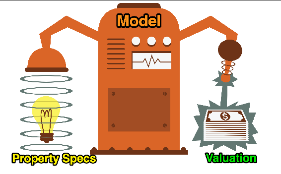

# Predict House Price
In this project I built a model that can provide a price estimate based on a home's characteristics. 
In order to complete this project I had to run a Multivariable Regression. 
**Libraries**: pandas, numpy, seaborn, plotly matplotlib  

 
 The project is part of [The Complete Python Pro Bootcamp](https://www.udemy.com/course/100-days-of-code) in which I enrolled in 2022. 

### Credits
>To know more about The App Brewery's courses visit <a href="https://www.appbrewery.co/">App Brewery</a>!